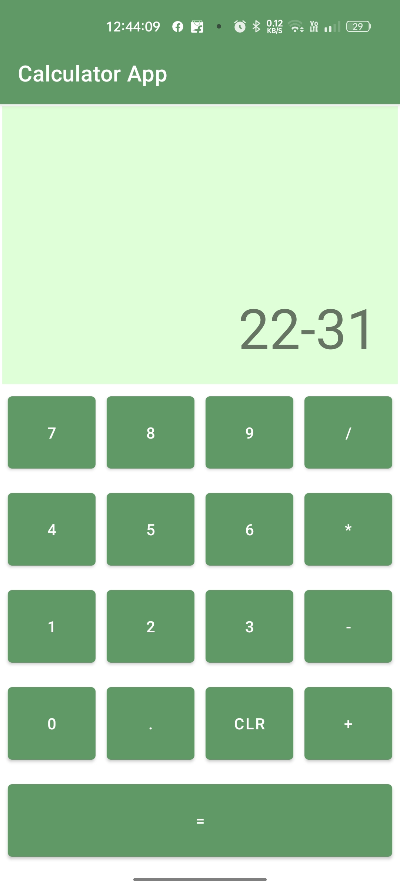

# Calculator App

{:width="40px" height="30px"}
{:width="40px" height="30px"}
{:width="40px" height="30px"}
{:width="40px" height="30px"}

This is a simple calculator app that performs basic arithmetic operations. It is designed to be user-friendly and easy to use.

## Features

- Addition (+)
- Subtraction (-)
- Multiplication (x)
- Division (/)
- Decimal point (.)
- Clear button (C)

## Installation

To use this calculator app, simply download the files from the repository and open the index.html file in your web browser.

Alternatively, you can view a live demo of the calculator app [here](https://example.com/calculator).

## Usage

To use the calculator app, simply click on the buttons to enter the numbers and operations. The display screen will show the current value, and the top of the screen will show the current equation.

To perform an operation, click on the operator button (+, -, x, or /) after entering the first operand. Then enter the second operand and click the equals button (=) to see the result.

To clear the display screen, click on the clear button (C).

## Contributing

If you would like to contribute to the calculator app, you can do so by forking the repository on Github and submitting a pull request.

## License

This calculator app is released under the MIT license. See LICENSE file for details.
